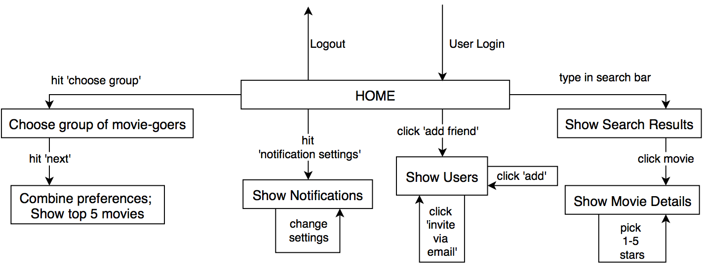

# Movie Matcher Project Proposal

## Members

* John Starich - js68634
* Jeremy Castillo - jcc4428
* Cesar Gonzalez - cg34887
* Josue Alfaro - jja2244

## Repo URL
<https://github.com/johnstarich/ee461l>

## Motivation

### Problem
There's no easy way to find movies groups of people want to watch. Our audience doesn't have a good way to choose movies they'd like to see, especially not with groups with various preferences.

### Target Audience
We're aiming for an audience of 18-25 year olds. Generally speaking, anyone interested in seeing movies with others.

### Demand
Users want to see movies they're interested in with other people. This website would enable them to reach out to their friends with our service and organize a trip to the movies. Based on the users' preferences, the site would provide a list of optimal choices for movies that a group of friends could watch together.

### Vision
We see this project becoming a large social hub for people to find and watch movies they want to see. Later we may decide to add user ratings and trend data for user movie preferences.

## Features and Requirements

### User Stories

1. Users can register and enter their movie preferences and watched movies.
2. Users can link up with their friends and generate a "Top 5" list of movies that they will most likely enjoy together. 
3. Users can subscribe for weekly updates on new upcoming movie releases.
4. Users will receive notifications based on new movies coming out and what their friends are up to.

### Functional Requirements

### Behavioral Requirements

### Non-functional Requirements
* Page load time must be under 5 seconds, ideally under ¼ second
* Must be scalable for future growth
* Code should follow basic style guidelines
* Use GitHub branching model
* Navigation should be intuitive and simple
* Search results should be relevant to queries
* Passwords should be encrypted, and run login over SSL

## Design

### Mock-ups

This mockup shows where users will be required to register before proceeding to the site.

This mockup shows where users will be required to login before proceeding to the site.

This mockup shows the home page of the site where users can view and rate upcoming, popular and "for you" (movies our site has indentified as possible choices for that user) movies.

This mockup shows the groups page of the site where users can view, edit, delete and find a movie for the their created groups.

This mockup shows the movies page of the site where a user can search through the movies database to rate and find movies they may be interested in.

This mockup shows the friends page of the site where users can search through their friends and find other users they have not been connected with yet. Also the option to edit their groups is provided.

This mockup shows the friends page of the site where a user has clicked on a group to edit and now the user can add and remove friends from the selected group.

This mockup shows the settings page of the site where a user can edit settings like their password, group and email notifications, and deleting their account (under an advanced setting).

### Class Diagrams

### Libraries and Languages
* Java - API language
* Spark - RESTful framework for web apps
* jQuery - JavaScript library for DOM manipulation and API calls
* Sass - CSS compiler language for more advanced CSS
* GSON - JSON parsing in Java
* MongoDB - Database backend for web app
* Bootstrap - pre-built UI framework for designing websites quickly
* Tomcat - web app deployment to personal server
* JUnit - unit testing library for Java
* Git - version control management software
* Log4J - logs control and management
* Jetty - Servlet backbone and runner

### Testing Plan
We will test for key functionalities such as:  
* User registration, login, and logout 
* Searching, selecting, and rating movies 
* Searching, adding, and deleting friends
* Creating, editing, and managing groups
* Editing preferences and notifications
* Generating the "Top 5" list of movies for a given group 
* Users subscribing and unsubscribing
* Users receiving weekly updates 

To do so, we will create and simulate different users interacting with the web application. We will have test suites for our modules to test before and after any modifications are made. Our testing will require having movie data for users to browse, search, select and rate. 

### Tentative Timeline
* March 6th - Basic UI functioning and movie data stored in MongoDB.
* March 20th - Search for movies and friends. Select and rate movies. Add/delete friends.
* April 3rd - Create and manage groups. Generate "Top 5" list of movies for group.
* April 17th - User preferences and notifications for subscribing and unsubscribing.
* May 1st - Final touches. Clean up.

## Feasibility
The successful completion of this project depends on two main factors: familiarizing ourselves with the libraries we plan to use, and balancing the load of the project by working together. 

First, the group has indentified libraries that will benefit the project. The group will form the necessary understanding for efficient use by familiarizing ourselves with those libraries early in the development process. The selected libraries are all widely used in industry, which allows to group to focus less on the reliability of the services and more on working with the technology. 

Finally, the group will balance the load of the project through the use of standard development process techniques. These techniques include weekly SCRUM meetings, constant team communication through Slack, and source code management with GitHub. 

### Group Member Contribution

The team worked together to design each of the diagrams included in this proposal, but the drawn out diagrams were completed as follows: 

John - compilation of powerpoint, project architecture
Josue - use case diagram, libraries description
Cesar - state chart diagram, 
Jeremy - mock ups, feasibility
