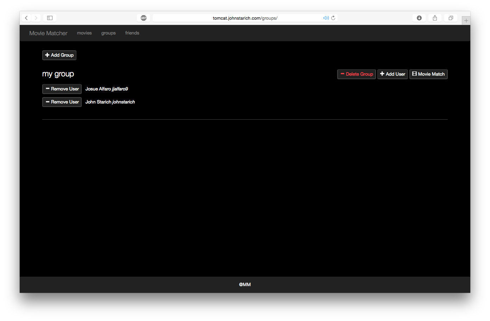

# Movie Matcher Project Final Report

## Members

* Josue Alfaro - jja2244
* Jeremy Castillo - jcc4428
* Cesar Gonzalez - cg34887
* John Starich - js68634

## Site

Login
<http://tomcat.johnstarich.com/login>

Register
<http://tomcat.johnstarich.com/register>

## API Repo
<https://github.com/JohnStarich/ee461l>

## UI Repo
<https://github.com/JohnStarich/ee461l-ui>

## Motivation

There is not an easy way to find movies that groups of people, with their various preferences, would want to watch together. Our goal is to bridge that gap and recommend movies to our audience based on all of their movie preferences.

## User Benefits

Users can register on the site and browse the movie database. Users would spend a lot less time trying to brainstorm different movies to watch and they would spend more time watching movies. Our web application is very easy to navigate, add friends, create groups, and it is not distracting. With a click of a button, a user’s group will be provided with a list of movies to watch and enjoy together.

## Feature Description and Requirements

1. Users can register, login and rate movies they've seen.
2. Users can link up with their friends and generate a "Top 20" list of movies that they will most likely enjoy together. 
3. Users can change their name and password. 
4. Users are able to add and delete friends from their friends list, and from their friends list create groups.

## Design

Movie Matcher is composed of two projects, the web UI and Java API.

### UI
The UI is built using the [Ember.js][] web application framework. Ember compiles all of the models, views, and controllers into a single application such that the entire site's front-end is downloaded upon visiting the site. Ember makes heavy use of JavaScript's ability to render HTML, so every single "page" is templated and modularized. It compiles [ES2015][]-compliant JavaScript into older versions of JavaScript, compiles [Sass CSS][] into normal CSS, and creates templated HTML components loaded in with whichever variables are provided.

Ember has significantly increased the quality of our site. It provides us with impressive functionality where we would otherwise have missed the opportunity. Of course, it has been a huge learning experience for all of us. Ember is a framework one can neither learn completely nor quickly. In our efforts to understand Ember, we have learned a great deal about how to develop for front-end [MVC][] frameworks and we will each likely use this experience again in the future.

[Sass CSS]: http://sass-lang.com
[Ember.js]: http://emberjs.com
[ES2015]: https://babeljs.io/docs/learn-es2015/
[MVC]: https://en.wikipedia.org/wiki/Model–view–controller

### API
The API for Movie Matcher is written in [Java][] using [Jetty][] as the servlet container back-end and the [Spark][] filter on top of that. Jetty is similar to [Tomcat][] in that it can package its applications into containers called "war" files, but its distinguishing feature is that is can also be run in an embedded fashion, such that its startup time during development is greatly decreased. Spark is a micro framework placed on top of Jetty's servlets that makes route creation and management significantly easier, yet everything remains quite extensible. We have built our entire API on top of Spark's and included custom extensions for our own use.

The data storage is done in a [MongoDB][] instance. The API communicates with MongoDB using the [Morphium][] driver which provides an easy interface for object storage and object updates. It enables us to simply annotate a common `AbstractModel` class that handles all DB operations except the specialized search queries. Every class extending AbstractModel automatically has support for a MongoDB collection and its load/store methods.

We encrypt our users' passwords using [jbcrypt][]. This library uses the [Blowfish][] cryptographic cipher to create one-way passwords that allow for [exponentially increasing computation time](http://www.openbsd.org/papers/bcrypt-paper.ps). This makes our application's password storage adaptable over time, despite computing power increases.

Tests are performed using both [JUnit][] and [Embedded MongoDB][]. Using a combination of these two libraries, we were able to write unit tests using JUnit for the simpler classes and full system tests using Embedded MongoDB for our database models.

[Java]: https://www.oracle.com/java/index.html
[Jetty]: http://www.eclipse.org/jetty/
[Spark]: http://sparkjava.com
[Tomcat]: http://tomcat.apache.org
[Morphium]: https://github.com/sboesebeck/morphium/
[MongoDB]: https://www.mongodb.com
[jbcrypt]: https://github.com/jeremyh/jBCrypt
[Blowfish]: https://en.wikipedia.org/wiki/Blowfish_(cipher)
[JUnit]: http://junit.org/
[Embedded MongoDB]: https://github.com/flapdoodle-oss/de.flapdoodle.embed.mongo

Overall design for Movie Matcher

Movie Matcher class diagrams

## User Interface

The user login page

The user registration page

The movies search results page, showing a user rating in yellow

The friends page, showing a user's current friends list

The friends search page, allows the user to add friends they search for

The confirmation for adding a friend

The create group page, allows the user to create new groups of friends to Movie Match on

The groups page, showing a created group and an added user

The "add friends to group" page, allows the user to add their friends to a Movie Match group

The groups page showing more users having been added to the group

The Movie Match recommendations for a group

The settings page, allows the user to change their username and name

The "change name" page

## Testing Tools, Test Scenarios, and Test Cases

Our application was divided into two different parts for testing, the first is the API (back end) and the second is the UI (front end). The team’s plan was to make sure that with each pull request on Github our systems would be tested. 
For each class within the API a JUnit test was created, this way we could test the functionality of each class separately. The Rating class was tested to make sure that a user could easily rate any movie. The loading, saving, and modifying aspects were also tested. The User class was tested so that each User could add friends, delete friends, create groups, delete groups, and login. The Session class was mainly tested to make sure that a session would be deleted from our database after x amount of time. The Group class was tested to ensure that adding friends into groups was fully functional as well as changing group names. The Movie class was tested to see that the equals method worked well. This completes the unit testing. 

All of our data is stored in MongoDB, so we decided to test the functionality of the database with our data. In order to do this without affecting our production database, we needed an instance of MongoDB run these tests after someone pushes to a pull request. Our solution was to add an embedded MongoDB instance that starts up, runs our tests, and throws out the data for every test. We saved Sessions, Movies, Ratings, Users, Groups, respectively in their own collections and we performed the following tests. We made sure to test the loading, saving, updating, and dropping of these data sets. The way we implemented this was by creating an AbstractModel that would handle those methods no matter what kind of data was being manipulated. 

The team decided it would be best if we did not merge buggy code onto our master branch. So a build pipeline was created for automatic testing and deployment once a team member made a pull request. Here is where we implemented regression and system testing. The code would be compiled and then all of our previous tests would be executed. This ensures that our previous code and implementations do not break with the new changes.

In terms of the front end, there was an ember automatic build that helped out when we would create and modify the front end. It was fairly quick because as soon as one saved a javascript or handlebars file we would know if that code broke or not. The team was not able to find an option where the UI tests could be done automatically. So with the help of browser debugging tools, the UI was tested by just playing with the features. 

Once we had most of the front and back end, a friend walked through our web application and reported what their opinion on the functionality of the website. We took their comments into consideration and made changes.
